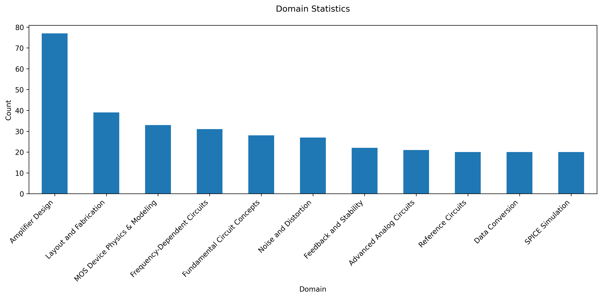

# AICB：類比積體電路基準測試

[English Version](README.md)

AICB（類比積體電路基準測試）是一個專門設計用於評估大型語言模型（LLMs）在類比積體電路設計、分析和理解相關任務上的表現。

## 概述

類比積體電路設計需要跨多個學科的深入知識，包括半導體物理、電路理論和電子系統。這個基準測試旨在評估 LLM 在類比電路概念推理、電路問題解決以及基本類比 IC 原理理解方面的能力。

## 數據集結構

基準測試數據集包含多個類比積體電路設計領域的選擇題。每個問題有四個選項（A、B、C、D），其中一個是正確答案。

數據集以 CSV 格式提供，包含以下欄位：

- `Question Number`：問題的唯一識別碼
- `Question`：問題文本
- `Option A`：第一個選項
- `Option B`：第二個選項
- `Option C`：第三個選項
- `Option D`：第四個選項
- `Correct Answer`：正確答案（A、B、C 或 D）
- `Domain`：問題所屬的特定類比 IC 領域

## 涵蓋領域

基準測試涵蓋以下類比 IC 設計的關鍵領域：

- 放大器設計（運算放大器、差動放大器）
- 雜訊分析
- 回授理論
- 頻率響應
- 穩定性和補償
- 偏置技術
- 能隙參考
- 類比數位和數位類比轉換器
- 振盪器設計
- 電源管理電路
- 製程、電壓和溫度（PVT）考量



## 使用方法

### 安裝

```bash
git clone https://github.com/yourusername/AICB-Analog-Integrated-Circuit-Benchmark.git
cd AICB-Analog-Integrated-Circuit-Benchmark
pip install pandas matplotlib
```

### 執行統計

```bash
python domain_statistics.py
```

這將生成一個顯示各領域問題分布的統計圖表。

## 輸出

程式會生成：

- 控制台輸出顯示每個領域的問題數量
- 高解析度（300 DPI）圖表，儲存為 `domain_statistics.png`
- 優化的標籤顯示，確保更好的可讀性

## 引用

如果您在研究中使用了 AICB，請引用：

```latex
@misc{aicb2025,
  author = {[Po-Hsiang, Hsu]},
  title = {AICB: Analog Integrated Circuit Benchmark},
  year = {2025},
  publisher = {GitHub},
  journal = {GitHub repository},
  howpublished = {\url{<https://github.com/treeleaves30760/AICB-Analog-Integrated-Circuit-Benchmark>}}
}
```

## 授權

本專案採用 MIT 授權條款 - 詳見 [LICENSE](LICENSE) 文件。
